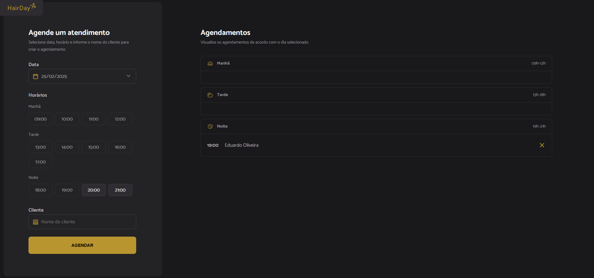

# HAIRDAY

Hairday é um sistema de agendamento de horários para salões de beleza, barbeiros e profissionais autônomos. O projeto permite que os clientes escolham datas disponíveis com base nos dias e horários livres do profissional. O projeto foi desenvolvido durante a aula do Rodrigo Gonçalves na plataforma Rocketseat.

## Tecnologias utilizada
HTML, CSS e JavaScript, Node.js

## Screenshot
